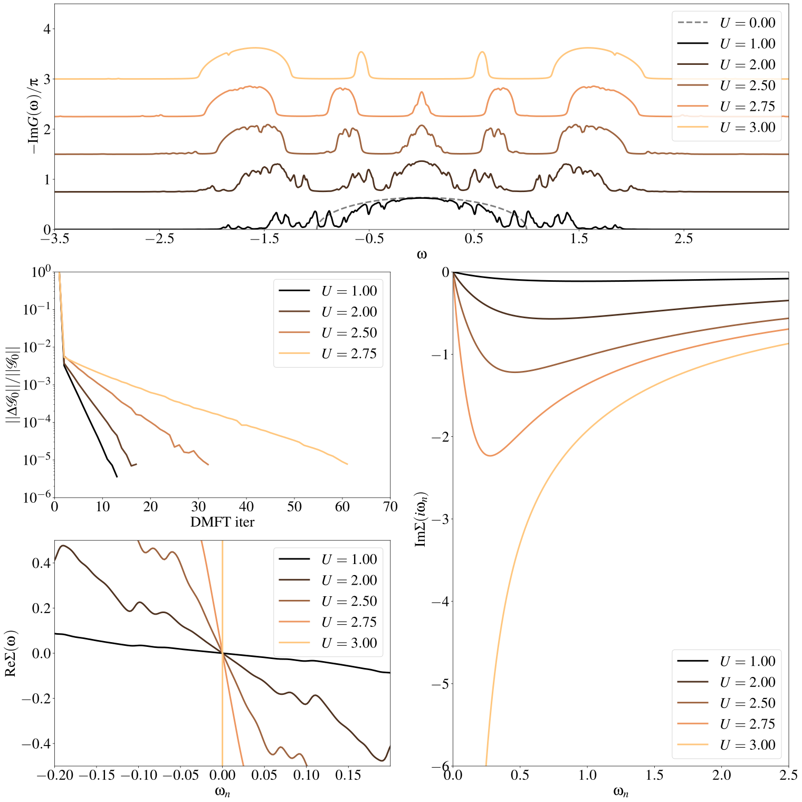

ED solver for Dynamical Mean-Field Theory
#########################################

In this section we take a step further to show how to integrate the
`EDIpack2.0` as a solver for Dynamical Mean-Field Theory calculations. 
Specifically, here we discuss the step-by-step implementation of a Fortran program (see
below) solving this model using DMFT with the `EDIpack2.0` exact
diagonalization algorithm at :math:`T=0`.

Similar to the previous section, we consider a Fermi-Hubbard
model defined on a Bethe lattice DOS
:math:`\rho(x)=\frac{1}{2D}\sqrt{D^2-x^2}`. The preamble of the
program includes variable definitions (a old-looking Fortran
specialty) and input file read:

.. code-block:: fortran

   program ed_hm_bethe
      USE EDIPACK2
      USE SCIFOR
      USE DMFT_TOOLS
      implicit none

      !> Number of discretization points for the Bethe DOS 
      integer,parameter                           :: Le=5000
      !> Bethe half-bandwidth = energy unit
      real(8),parameter                           :: D=1d0
      !> Bethe DOS and linear dispersion
      real(8),dimension(Le)                       :: DOS
      real(8),dimension(Le)                       :: ene
      !>Bath:
      real(8),allocatable                         :: Bath(:)
      !> local dynamical functions, rank-5 [Nspin,Nspin,Norb,Norb,L]
      !   (we could use other format )
      complex(8),allocatable,dimension(:,:,:,:,:) :: Weiss,Smats,Sreal,Gmats,Greal,Weiss_
      !> input file
      character(len=16)                           :: finput

      !> Use SciFortran parser to retrieve the name of input file 
      call parse_cmd_variable(finput,"FINPUT",default='inputED.conf')
      
      !> READ THE input using EDIpack procedure: 
      call ed_read_input(trim(finput))

In this  we load both the `EDIpack2.0` and `SciFortran` libraries through
their main module :f:mod:`edipack2` and :f:mod:`scifor`. We  define
some local variables and  read the input file
(default :code:`"inputED.conf"`) using the `EDIpack2.0` function :f:func:`ed_read_input`.

The next step is to construct the Bethe lattice DOS, we use
`SciFortran` procedure to simplify the task:

.. code-block:: fortran

   Ene = linspace(-D,D,Le,mesh=de)
   DOS = dens_bethe(Ene,D)

Once the local dynamical functions have been allocated, we can proceed
to allocate the user side bath :f:var:`bath` and initialise the ED
solver by calling the :f:func:`ed_init_solver` procedure:

.. code-block:: fortran

   Nb=ed_get_bath_dimension()
   allocate(bath(Nb))
   call ed_init_solver(bath)

On input the :f:var:`bath` is guessed from a flat distribution
centered around zero and with half-width :f:var:`ed_hw_bath`. If a
file :f:var:`hfile` with suffix `.restart` containing bath parameters is found in the run
directory then the bath is read from file.

We are now ready to perform a DMFT self-consistency cycle. In the
present it looks like:

.. code-block:: fortran
   :linenos:
   :emphasize-lines: 6, 19

   iloop=0;converged=.false.
   do while(.not.converged.AND.iloop<nloop)
     iloop=iloop+1
     
     !> Solve the effective impurity problem
     call ed_solve(bath)
     
     !> Impurity Self-energy on Matsubara axis
     call ed_get_sigma(Smats,'m')

     !> Build a local Green's function using the Impurity Self-energy
     wfreq = pi/beta*(2*arange(1,Lmats)-1)   !automatic Fortran allocation
     do i=1,Lmats
        zeta= xi*wfreq(i)+xmu - Smats(1,1,1,1,i)
        Gmats(1,1,1,1,i) = sum(DOS(:)/( zeta-Ene(:) ))*de  ! One can do better than this of course 
     enddo

     !> Self-consistency: get the new Weiss field:
     Weiss(1,1,1,1,:) = one/(one/Gmats(1,1,1,1,:) + Smats(1,1,1,1,:))
     !> Mix to avoid trapping:
     if(iloop>1)Weiss = wmixing*Weiss + (1.d0-wmixing)*Weiss_

     !> Close the self-consistency fitting the new bath:
     call ed_chi2_fitgf(Weiss,bath,ispin=1)
     
     !>Check convergence
     converged =( sum(abs(Weiss(1,1,1,1,:)-Weiss_(1,1,1,1,:)))/sum(abs(Weiss(1,1,1,1,:))) )<dmft_error
     Weiss_=Weiss     
   enddo

The first step, line 9, is to call the :f:func:`ed_solve` procedure in
`EDIpack2` which solve the quantum impurity problem defined by a given
input bath :f:var:`bath`. On exit, all the ED related quantities are
stored in the memory, ready to be retrieved upon call.
For instance we retrieve the Matsubara self-energy
:math:`\Sigma(i\omega_n)` using the procedure :f:func:`ed_get_sigma`
and store the result in the array :f:var:`Smats`.

Next, lines 12-16, we evaluate the local Green's function
:math:`\int^{D}_{-D} d\epsilon \frac{\rho(\epsilon)}{\zeta-\epsilon}`
where :math:`\zeta=i\omega_n+\mu-\Sigma(i\omega_n)`.
This function is used to update the Weiss field :math:`{\cal G}_0`
using the **self-consistency** relation (line 19):

.. math::

   {\cal G}_0(i\omega_n) = \left[ G^{-1}_{loc}(i\omega_n) + \Sigma(i\omega_n)\right]^{-1}

The closing step of the DMFT cycle, specific of the Exact
Diagonalization solver, is to project the obtained Weiss field onto
the set of Anderson non-interacting Green's function
:math:`G^{And}_0(i\omega_n;\vec{b})` describing a discretized bath of
:f:var:`Nb` parameters. This step is performed using the complementary
method :f:func:`ed_chi2_fitgf`, which optimize the bath parameters
by minimizing the distance between such two functions. See line 24.

The cycle close with a simple error check on the Weiss field itself. 

   
.. raw:: html

   

In the following we present some results obtained with this simple
method.

